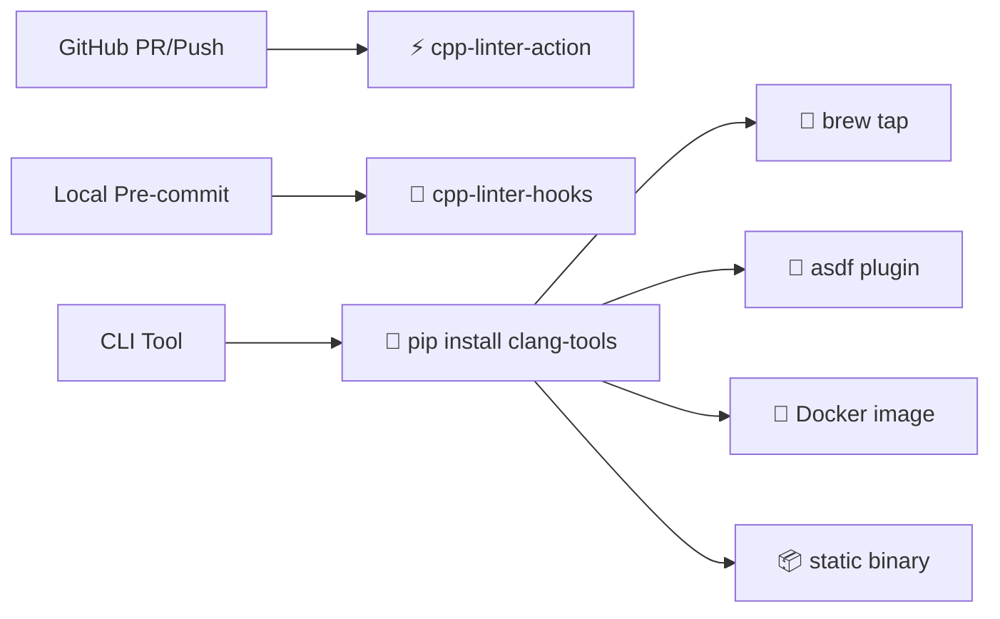

<!-- markdownlint-disable MD036 MD041 MD033 -->

<div align="center">

  

  # cpp-linter

  ### C/C++ linting and formatting — for CI, CLI, and local development.

  <a href="https://cpp-linter.github.io/">
    
  </a>
  <a href="https://github.com/cpp-linter/cpp-linter">
    
  </a>
  <a href="https://github.com/marketplace/actions/cpp-linter-action">
    
  </a>
  <a href="https://github.com/cpp-linter/cpp-linter-hooks">
    
  </a>
  <a href="https://github.com/cpp-linter/.github/blob/main/LICENSE">
    
  </a>

  <br />

  <table>
    <tr>
      <td align="center">
        <code>⬢ Linux</code>
      </td>
      <td align="center">
        <code>🍎 macOS</code>
      </td>
      <td align="center">
        <code>⊞ Windows</code>
      </td>
      <td align="center">
        <code>📦 x86_64</code>
      </td>
      <td align="center">
        <code>📱 arm64</code>
      </td>
    </tr>
  </table>

</div>

---

## 🎯 What is cpp-linter?

**cpp-linter** packages `clang-format`, `clang-tidy`, and other LLVM tools into distributions that work across local machines, CI pipelines, containers, and package managers — so you don't need to build LLVM from source or manage platform-specific paths.

Use **pip**, **brew**, **asdf**, **Docker**, or a **GitHub Action** — whichever fits your workflow.

---

## 🧭 Pick your entry point

Not sure where to begin? Follow the decision flow below:



| Your goal | Start here | One-liner |
|-----------|------------|-----------|
|  Lint & format **PRs / pushes in CI** | [cpp-linter-action](https://github.com/cpp-linter/cpp-linter-action) | Add to `.github/workflows/` |
|  Catch issues **before you commit** | [cpp-linter-hooks](https://github.com/cpp-linter/cpp-linter-hooks) | Add to `.pre-commit-config.yaml` |
|  Install **cross-platform CLI** | [clang-tools-pip](https://github.com/cpp-linter/clang-tools-pip) | `pip install clang-tools` |
|  Install natively on **macOS** | [homebrew-tap](https://github.com/cpp-linter/homebrew-tap) | `brew tap cpp-linter/tap && brew install clang-tools` |
|  Manage versions in a **polyglot team** | [asdf-clang-tools](https://github.com/cpp-linter/asdf-clang-tools) | `asdf plugin add clang-tools` |
|  Use **containers / custom CI images** | [clang-tools-docker](https://github.com/cpp-linter/clang-tools-docker) | `docker pull ...` |
|  Grab the **raw static binary** | [clang-tools-static-binaries](https://github.com/cpp-linter/clang-tools-static-binaries) | Download from releases |

> 💡 **New here?** Start with [**cpp-linter-action**](https://github.com/cpp-linter/cpp-linter-action) for CI, or [**cpp-linter-hooks**](https://github.com/cpp-linter/cpp-linter-hooks) for local pre-commit. To install the underlying clang tools directly: `pip install clang-tools`.

---

## ⚡ See it in action

### CI — Lint pull requests automatically

```yaml
# .github/workflows/cpp-linter.yml
name: cpp-linter
on: pull_request

jobs:
  cpp-linter:
    runs-on: ubuntu-latest
    steps:
      - uses: actions/checkout@v4
      - uses: cpp-linter/cpp-linter-action@v2
        env:
          GITHUB_TOKEN: ${{ secrets.GITHUB_TOKEN }}
        with:
          style: file          # format against your .clang-format
          tidy-checks: ''      # analyze against your .clang-tidy
```

The action posts **inline annotations**, a **step summary**, and optionally **PR review suggestions** — no extra config needed. → [Full docs](https://github.com/cpp-linter/cpp-linter-action)

### Local — Lint and format from the command line

```bash
# Install anywhere
pip install clang-tools

# Lint a single file
clang-format -n src/main.cpp
clang-tidy src/main.cpp -- -std=c++20

# Fix formatting in-place
clang-format -i src/*.cpp
```

→ [CLI docs](https://github.com/cpp-linter/cpp-linter)

---

## 📦 All packages

<details>
<summary><strong>Lower-level and specialized packages</strong></summary>

<br />

| Package | Description |
|---------|-------------|
| [clang-tools-static-binaries](https://github.com/cpp-linter/clang-tools-static-binaries) | 🧱 **Foundation** — Statically-linked binaries for Linux, macOS, Windows. Everything else builds on this. |
| [clang-tools-wheel](https://github.com/cpp-linter/clang-tools-wheel) | 🐍 Python wheels redistributing `clang-format` & `clang-tidy`. |
| [clang-apply-replacements](https://github.com/cpp-linter/clang-apply-replacements) | 🔧 Standalone wheel for `clang-apply-replacements`. |
| [clang-include-cleaner](https://github.com/cpp-linter/clang-include-cleaner) | 🧹 Detect unused `#include` directives. |

Browse **all repos** on the [organization page →](https://github.com/cpp-linter)

</details>

---

## Why cpp-linter?

| | Problem | How cpp-linter helps |
|---|---|---|
| ⏱️ | Building LLVM from source is time-consuming | Pre‑built binaries, ready to use |
| 📦 | clang tools may not be in your distro's package manager | Available via **pip, brew, asdf, Docker** |
| 🔄 | Paths and behavior differ across macOS, Linux, Windows | **Consistent interface** across OS and architectures |
| 📐 | Need to pin tool versions across a team | Version management via **asdf** or **pip** |

---

## 👥 Maintainers

<table>
  <tr>
    <td align="center">
      <a href="https://github.com/shenxianpeng">
        <br />
        <b>shenxianpeng</b>
      </a>
    </td>
    <td align="center">
      <a href="https://github.com/2bndy5">
        <br />
        <b>2bndy5</b>
      </a>
    </td>
  </tr>
</table>

---

## 🤝 Contributing

We welcome all contributions — bugs, feature requests, docs, and code.

- 📋 Read our [Code of Conduct](https://github.com/cpp-linter/.github/blob/main/CODE_OF_CONDUCT.md)
- 🔧 Check individual repos for their `CONTRIBUTING.md`
- 💬 Join the discussion on [GitHub Discussions](https://github.com/orgs/cpp-linter/discussions)

---

<p align="center">
  <sub>Made with ❤️ by the cpp-linter community &nbsp;·&nbsp; Powered by <a href="https://clang.llvm.org/extra/clang-tidy/">clang-tidy</a> & <a href="https://clang.llvm.org/docs/ClangFormat.html">clang-format</a></sub>
</p>
