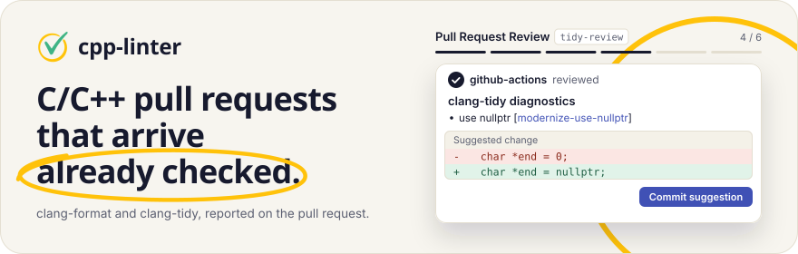

<!-- markdownlint-disable MD033 MD041 -->

<picture>
  <source media="(prefers-color-scheme: dark)" srcset="../assets/profile-banner-dark.svg">
  
</picture>

cpp-linter runs clang-format and clang-tidy on C and C++ code: on every pull request,
before every commit and on your laptop, at the same LLVM version.

[Website](https://cpp-linter.github.io/) ·
[Get started](https://cpp-linter.github.io/getting-started/) ·
[Showcase](https://cpp-linter.github.io/showcase/) ·
[Discussions](https://github.com/orgs/cpp-linter/discussions) ·
[Sponsor](https://opencollective.com/cpp-linter)

### Pick where the checks run

| Where | Project | Start with |
| :-- | :-- | :-- |
| On every pull request | [cpp-linter-action](https://github.com/cpp-linter/cpp-linter-action) | `uses: cpp-linter/cpp-linter-action@v2` |
| Before every commit | [cpp-linter-hooks](https://github.com/cpp-linter/cpp-linter-hooks) | `args: [--style=file, --version=21]` |
| Locally or in other CI | [cpp-linter](https://github.com/cpp-linter/cpp-linter) | `pip install cpp-linter` |
| Just the clang tools | [clang-tools](https://github.com/cpp-linter/clang-tools-pip) | `pip install clang-tools` |

The clang tools also come as [static binaries](https://github.com/cpp-linter/clang-tools-static-binaries)
for Linux, macOS and Windows, a [Homebrew tap](https://github.com/cpp-linter/homebrew-tap) for macOS,
an [asdf plugin](https://github.com/cpp-linter/asdf-clang-tools) and
[Docker images](https://github.com/cpp-linter/clang-tools-docker).

Maintained by two volunteers, [@shenxianpeng](https://github.com/shenxianpeng) and
[@2bndy5](https://github.com/2bndy5). Sponsorship goes to the project through
[Open Collective](https://opencollective.com/cpp-linter), where all income and expenses are public.
